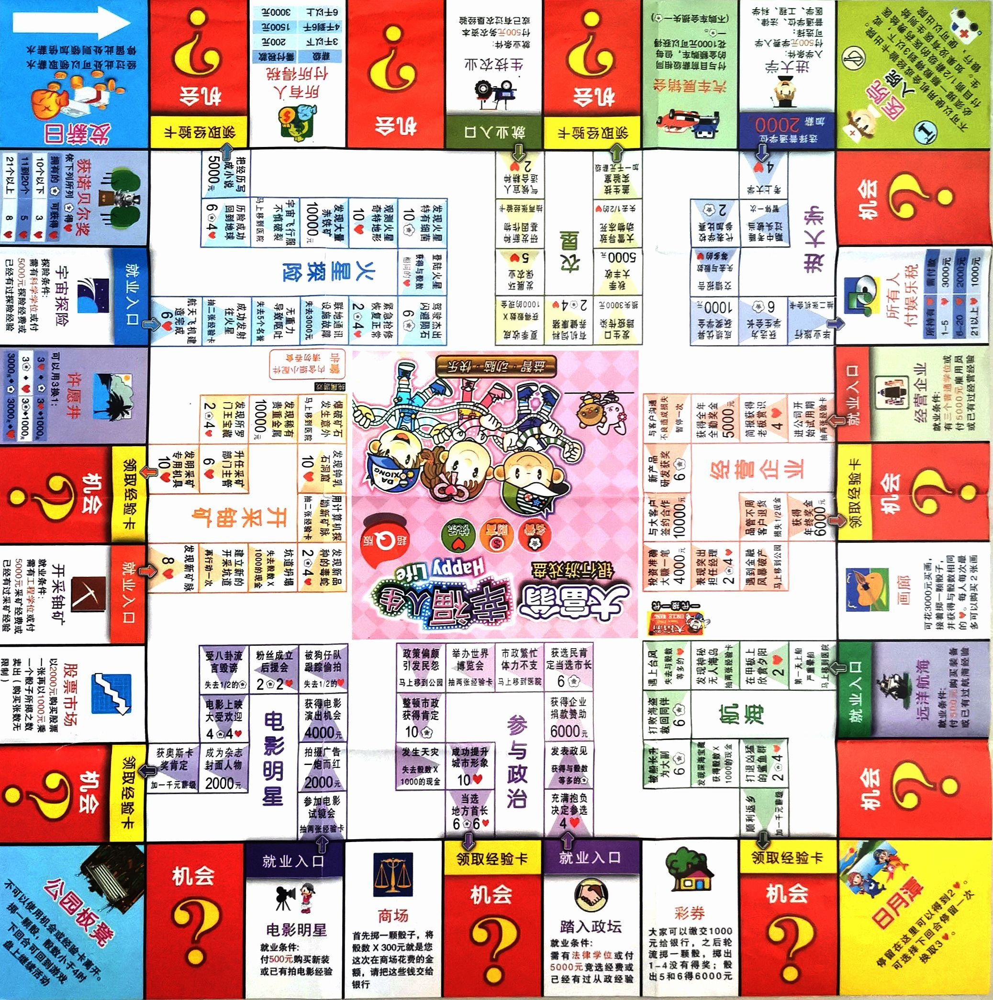

# 菜根人生

> 来源：语雀文档 https://www.yuque.com/greatnju/memory/bkld4hqgyczf6abg

---

> 金钱探索值数值待定，涉及汇率最后再写。

## 机制设置

### 基础机制
💰 金钱，💯 GPA，🐋 探索值

**数值模型：** 1探索值=0.1GPA=100金钱

考虑到是线下，最好不要设置过于复杂的机制，比如持续几回合，或者是较复杂的计算。

### 起始配置
- 两个骰子，金钱2000，GPA3.0，探索值0，所有点数相关的判定事件仅采用一个骰子。
- 一个骰子，金钱3000，GPA3.0，探索值0

**失败条件：** 金钱小于0，金钱等于0可以继续正常游戏，GPA和探索值最小值为0。

**基础胜利条件：** GPA*10+探索值 >= 60

**额外胜利条件：** 起始每人抽取三张培养方案，选择一到两项保留并公开，其余放回原牌堆。

**胜利条件限制：** 额外胜利条件（培养计划）每人至多保留两项，达到任意一项胜利条件即可获胜。

**确认培养计划：** 每经过6个回合，可以确认一项培养计划（即本项额外胜利条件不能再经过任意方式替换）。每确认一项培养计划，可以选择移动到任意一条线的起点处（需要交入场费），若经过发薪起点不领取工资。

执行每项事件或抽取机会卡/命运卡时，建议真情实感地以第一人称大声念出。

## 培养计划

- **文学院：** 当你离开赚在南哪线时，如金钱未发生变化（不考虑终点经验卡效果），你获胜。【当你到达蒋公的面子时，改为选择一项执行：获得100金钱，或大声喊出不吃，并赢得全场掌声和2探索值】
- **历史学院：** 当你按顺序经过或进入过鼓楼、浦口、仙林和苏州校区线后，你获胜。【你移动到鼓楼线入口】
- **哲学系：** 当你完整进出某条线，且探索值和GPA没有任何变化时（不包括终点经验卡效果），你获胜。【你的GPA至低为3.0】
- **法学院：** 当场上出现破产玩家且不是你时，你获胜。【免除下一次金钱损失】
- **商学院：** 当你金钱数达到5000时，你获胜。【直接移动至赚在南哪，不交入场费，经过起点不领取工资】
- **外国语学院：** 当你抽到过两张（可以重复）包含英文字母（除了GPA）的事件/机会/命运卡后，你获胜。【立即抽取一张机会卡或命运卡】
- **新闻传播学院：** 当你完整经过乐在南哪线，且全程没有探索值和GPA扣减，你获胜。【你进入乐在南哪线不需要入场费】
- **政府管理学院：** 当你的探索值、GPA和金钱数均不和场上除你外任何玩家一致时，你获胜。【你进入四个校区线的入场费改为150金钱】
- **国际关系学院：** 你和至少两名其他玩家互相使用过机会卡后，你获胜。【指定一位除你外的玩家，抽取一张机会卡】
- **信息管理学院：** 当你抽到过不重复的五个标题中以数字开头的机会卡/命运卡后，你获胜。【你可以立即重新分配场上所有玩家拥有的卡片，至多三张】
- **社会学院：** 当你的探索值比场上探索值最低玩家高20时，你获胜。【你可以选择永久减少一个胜利条件位，将本培养计划的获胜条件修改为高15】
- **数学系：** 当你第三次到达鼓楼校区线终点后，你获胜。【可以指定下一回合自己的骰子点数】
- **物理学院：** 你在计算基础胜利条件时，可以从金钱、GPA和探索值中任选两项参与计算，其中每项分数=探索值=GPA*10=金钱数/100，任意两项达到60，你获胜。【下一回合你选择前进双倍点数或后退双倍点数】
- **天文与空间科学学院：** 你和场上剩余每一个其他玩家同时在同一个格子停留过，你获胜。【移动去候车厅，经过起点不领取低保】
- **化学化工学院：** 当你的探索值达到45时，你获胜。【你可以选定一个格子和一条线，下一回合失效】
- **人工智能学院：** 当你的GPA比场上GPA最低的玩家高2.0时，你获胜。【你可以选择永久减少一个胜利条件位，将本培养计划的获胜条件修改为高1.5】
- **计算机科学与技术系：** 当你的探索值和金钱数字中均只包含0或1时，你获胜。【你立即选择一项执行：增加1探索值，或增加100金钱】
- **软件学院：** 当你到达交学费格子时，你可以改为支出3200金钱，若你没有破产，你获胜。【你的金钱数可以至低为-1000】
- **电子科学与工程学院：** 若你在科创赛事投到6，你获胜。【你在科创赛事只需要失去0.1的GPA即可执行投掷】
- **现代工程与应用科学学院：** 当你进入过除苏州校区外所有线时，你获胜。【你可以立即抽取一张命运卡，并指定一位玩家执行该效果】
- **环境学院：** 当你经历过仙林校区线的每一个事件后，你获胜。【你每经历一次直接移动事件，获得2探索值】
- **地球科学与工程学院：** 当你进入过每一条线后，你获胜。【你每进入过不重复的一条线，每条线入场费减少100】
- **地理与海洋科学学院：** 当你执行过四个校区线的终点效果后，你获胜。【你每进入过不重复的一个校区，每条线入场费减少100】
- **大气科学学院：** 如果在20个回合内，你的金钱数额始终不为唯一最多，你获胜。【你可以立即抽取三张机会卡或命运卡，并至多选择其中一张执行】
- **生命科学学院：** 当你在食在南哪线连续三次没有触发负面效果（麦门护盾卡不计入次数，但是不算作中断连续），你获胜。【获得场上或卡堆中的麦门护盾（单次使用，食堂线屏蔽负面效果）】
- **医学院：** 当你进入过三次医院后，你获胜。【当你进入医院后，不需要付款即可出院】
- **工程管理学院：** 当你第二次金钱数为0时，你获胜。【获得场上或卡堆中的余额为负（单次使用，可以抵消一次不小于当前剩余金钱的支出）】
- **匡亚明学院：** 当你满足任意玩家的已固定培养计划时，你获胜。【GPA增加0.1或探索值增加1】
- **海外教育学院：** 当有玩家获胜时，若你对其使用过至少两次机会卡，你优先获胜。【你可以自行选择是否进入食在南哪线】
- **建筑与城市规划学院：** 当你经历过起点、校医院、鼎、候车厅和闯门后，你获胜。【你进入鼓楼校区线，不需要支付入场费】
- **马克思主义学院：** 当你GPA达到4.5时，你获胜。【当你走到社团格子时，改为直接获得2探索值】
- **艺术学院：** 当你经历过浦口线每个事件后，你获胜。【你在浦口线终点处可以执行双倍经验卡效果】
- **苏州校区：** 当你经历过苏州校区的每个事件后，你获胜。【你每次进入苏州校区线不需要缴纳入场费，在其它三校区起点处可以选择失去300金钱移动到苏州校区线起点】

## 棋盘设置

### 基本方格

#### 四角方格
- **起点/低保日：** 经过此处可以领取低保，停留此处则加倍领取。【维持原版不变，可以就叫工资，每月26.9那个】考虑到本科269不好计算，就用研究生低保500，每过一次领取500，停留领取600（研三每月600）
- **校医院：** 在医院必须投骰子到3，或选择付250金钱的医药费，便可以出院，也即下回合回到游戏正常投骰。【校医院每周三下午集体学习不开诊】
- **鼎：** 暂停一回合，如果本回合骰子点数是所有玩家中最大的之一，则不需要暂停。
- **会议中心：** 停留在这里可以选择失去？金钱，换取额外的？探索值，并自行选择是否停留一回合。（金钱买名誉是不是有点问题）
- **候车厅：** 停留在这里可以选择失去200金钱，移动到棋盘上任意大格子点并执行对应事件，其中经过或停留在起点（发工资）不领取工资；如选择到某条线起点处，则不需要付入场费。

#### 机会方格
【维持原位置不变】，改为抽取一张机会卡【多人事件】或一张命运卡【单人事件】

#### 事件方格（顺序从起点发薪日开始）
- **所有人交学费：** 交（5.0-GPA）*100元
- **蒋公的面子：** 你必须选择一项执行，支付300金钱获得3探索值，或损失2探索值并获得200金钱。
- **重修：** GPA低于3.5的玩家可以选择失去100金钱，投掷一次骰子，若为偶数则获得0.2GPA。
- **社团：** 可以选择是否执行：失去200的金钱或0.2的GPA，投掷一次骰子，获得1*点数的探索值。
- **紫荆站：** 选择一项执行：失去100金钱并抽取一张培养方案，或抽取一张机会卡或命运卡。
- **南哪诚品：** 交给场上其它玩家每人50金钱。【蓝鲸诚品，不行】
- **科创赛事：** 可以选择失去0.3的GPA，并投掷一次骰子，获得0.1*点数的GPA。【参加保研加分的赛事的代价】
- **闯门：** 可以选择停留一回合，并获得0.2GPA；或失去0.1GPA，并向前移动一格，领取停留在起点600低保。
- **勤工助学：** 获得240金钱，并暂停一回合，如果是金钱最少的玩家则额外获得240金钱。【勤工助学1h24块】

### 职业方格

每条线结束立即使用经验卡，执行对应事件。

#### 1 农垦：浦口线【浦口校区】
期望：GPA增加0.1，金钱减少100，探索值减少2==损失200金钱，刚好等于入场费
走到入口处强制进入，进入无需付费

- **图书馆空调没有开放：** GPA减少0.2
- **三地奔波：** 为了满足跨专业选课而在仙鼓浦之间通勤：金钱（交通费）减少200，GPA增加0.3
- **地广人稀，社团活动严重不足，超市很早关门：** 探索值减少2，抽一张机会卡或命运卡
- **地理位置荒僻，更适合潜心学习嚼菜根：** 金钱增加100，GPA增加0.2。
- **交通不便，实习困难，毕业前景一片黑暗：** 探索值减少1，抽一张机会卡或命运卡
- **手手速报：** 摇骰子：
  - 奇数：今天的速报也和浦口没有什么关系呢，探索值减少2。
  - 偶数：学校发展蒸蒸日上，探索值增加3。
- **浦口必要设施缺失，打印店、咖啡店、奶茶店、轻食店纷起于宿舍：** 金钱增加200，探索值增加2，GPA减少0.2。
- **浦口食堂及菜品匮乏，缺少前进动力：** 下一次由前进改为倒退【反饥饿传统】
- **大门还悬挂着南哪大学金陵学院：** 探索值减少2
- **电脑出了故障，可是浦口没有IT侠侠营业：** 金钱减少100，抽一张机会卡或命运卡
- **快递被寄到了隔壁车大成贤：**
  - 奇数：投稿乙烷，探索值增加1
  - 偶数：抽取一张机会卡或命运卡
- **室外晾晒被子，但是由于浦口鸟比人多，被子被鸟屎污染：** 金钱减少100

**浦口线经验卡：** 跨校区调宿，金钱增加400，可以选择移动至鼓楼/仙林/苏州线入口处，经过起点不领取低保。

#### 2 进大学：学习线（GPA线）【学在南哪】
期望：GPA增加0.8，探索值0，金钱增加200==纯赚GPA
入场费：200金钱

- **期末考试通宵复习：**
  - 奇数：补天成功，GPA增加0.2。
  - 偶数：一不小心睡着了错过考试，在此停留一回合，GPA减少0.1，然后下一回合重新投掷骰子判定，直至投到奇数
- **奖学金评选：** 【人奖/10】
  - GPA不低于4.5：获得300金钱，GPA增加0.1。
  - GPA不低于4.0：获得200金钱，GPA增加0.2。
  - GPA低于4.0：获得100金钱，GPA增加0.3。
- **发现图书馆延迟了闭馆时间：** GPA增加0.2，抽取一张机会卡或命运卡
- **下载了南哪课表来方便查看课程信息：** 探索值增加2
- **发现学校增开了通宵教室：** GPA增加0.2，抽取一张机会卡或命运卡
- **发现老师又布置了人见人爱的小组作业：** GPA减少0.2，抽取一张机会卡或命运卡
- **线上课发现忘了关闭摄像头，还通过空格快捷键打开了麦克风：** 探索值减少4
- **选修外专业课程，并在期中火葬场之前急流勇退：** GPA增加0.1，探索值增加2，抽取一张机会卡或命运卡。
- **毕业答辩：**
  - GPA不低于3.0：顺利答辩，毕业旅行：GPA增加0.3，抽取两张机会卡或命运卡。
  - GPA低于3.0：被迫延毕，回到学习线起点并重新扣除进入学习线的金钱。

**学习线经验卡：** 保研成功，GPA增加0.2，可以选择投骰子，1或2移动至浦口线并立即进入，3或4移动至鼓楼线，5或6移动至仙林线，不需要支付入场费。（苏州暂无保研生）

#### 3 经营企业：家教兼职创业线（金钱线）【赚在南哪】
期望：探索值增加4，GPA0，金钱增加760==净赚960
入场费：200金钱

- **违反校规开办考研辅导：** 探索值减少5，金钱减少300。
- **通过朋友接到了没有中介费的家教：** 金钱增加200
- **创办南哪闲闲：** 可指定场上除自己外两名玩家交换金钱数值。
- **在去宿舍路上看到领取校园卡的摊点：**
  - 奇数：一不小心就实名办卡了，发现校园套餐资费逐年走高，金钱减少100
  - 偶数：还好你看过南哪手手的防骗指南，在书院同学处报到领取校园卡，探索值增加2
- **每次都积极填写ITSC的问卷调查和听讲座来白嫖下月网费：** 金钱增加200【一学期通常五个月*20，因此一年200】
- **校园卡丢失：**
  - 奇数：还好关注了权服侠侠，及时找回了校园卡，探索值增加2，抽取一张机会卡或命运卡
  - 偶数：被迫重办了一张校园卡，然后顺便换了照片，金钱减少20*点数
- **发现校园卡充值叠加优惠：** 金钱增加点数*100
- **依托众创空间建立公司雏形：**
  - 骰子数为1或6：产品一推出即人气爆棚，金钱翻倍，探索值增加6
  - 骰子数为2或3或4或5：一直没有实现盈利，团队成员也依次毕业退出，金钱减少至全场玩家最低，GPA减少至3.0
- **暑假留在学校参加包装录取通知盒流水线工作：** 金钱增加200，探索值增加3，抽取一张机会卡或命运卡
- **成功获得到校友内推：** 金钱增加200，探索值增加2

**金钱线经验卡：** 校友企业，金钱增加500，若金钱总额超过1500，则减少500金钱，增加探索值5，即用于捐赠。

#### 4 航海：苏州线【苏州校区】
期望：金钱减少200，GPA增加0.5，探索值增加7.5==净赚400
入场费：200金钱

- **明明说好嚼菜根，你却开了荤：** 探索值增加2，抽取一张机会卡或命运卡
- **课没修够两地奔波：** 金钱减少200，GPA增加0.3。
- **苏州专业名高大上：** 探索值增加2，抽取一张机会卡或命运卡
- **半壁江山竟仍是工地：** 探索值减少1，抽取一张机会卡或命运卡
- **作为首批小白鼠得到了充足的慰问：** 探索值增加1，金钱增加200。
- **培养计划是一个套娃盲盒：**
  - 奇数：和开甲同名的课但是因为分流需要提前DDL，GPA减少0.1，抽取一张机会卡或命运卡
  - 偶数：在同样时间内速通了更多门课程，GPA增加0.3，抽取一张机会卡或命运卡。
- **另起炉灶，学生组织和社团活动一片空白：** 抽取两张机会卡或命运卡，GPA增加0.1
- **苏州的机场究竟是虹桥还是浦东：** 金钱减少200
- **室内雪世界的饼已经画好了：** 探索值增加1
- **探索者：** 关于苏州校区的各项指南太少，只能依靠大家自力更生，自己探索
  - 偶数：将探索结果整理成《苏州校区生存指南》发布，并向手手投稿，探索值增加5
  - 奇数：单打独斗，身心俱疲，怀念手手的指南和速报，抽取一张机会卡或命运卡

**苏州线经验卡：** 未来科技，掷一次骰子，让除自己外某位玩家，前进或后退相应的点数。

#### 5 参与zz：学生组织和活动线（探索线）【乐在南哪】
期望：探索值增加18.5，金钱减少330，GPA增加0.1==净赚疯了，谁当时说这个不行的
入场费：200金钱

- **十大歌星：**
  - 骰子数1或3：有幸游过了第一轮，探索值增加1
  - 骰子数为5：获得新一届十大歌星称号，探索值增加4
  - 偶数：排了很久的队，结果还没一个好位置，暂停行动一回合。
- **在运动会开幕式/迎新晚会上发挥社牛属性，表演视频被投稿在南哪墙墙并被表白捞人：** 探索值增加2
- **在百团大战加入社团，为爱发电，收获至交与成长：** 选择一名其它玩家，你和其各自金钱减少100，探索值增加5
- **热心志愿，积极社会实践，对支教活动一片赤诚之心：**
  - 探索值不小于10，探索值增加4，抽取一张机会卡或命运卡
  - 探索值不足10，探索值增加2
- **选择学生组织留任：**
  - 奇数：刻苦认真，完成留任后组织奋进目标，探索值增加3，抽取一张机会卡或命运卡
  - 偶数：力不从心，摸鱼躺平，拿到工作证明万事大吉：探索值减少3，抽取一张机会卡或命运卡
- **著名人物到访南哪，在前排亲切交流科研成果：** 探索值增加3，抽取一张机会卡或命运卡
- **参与筹备学生活动，需要跨校区物资运输、人员组织，又恰逢课堂小测：** 探索值增加2，金钱减少100，GPA减少0.1
- **与ta相识于组织/活动，MBTI相合，成为搭子：** 探索值增加1，GPA增加0.2，金钱减少200
- **恰逢 120 周年校庆：** 获得电子餐券，金钱增加20*点数
  - 探索值不小于15：作为志愿者全程参与校庆，暂停一回合
  - 探索值小于15
    - 奇数：作为观众参加升旗仪式、校庆大会及校庆音乐节，探索值增加3
    - 偶数：毫无校庆参与感，只有电子餐券，抽取一张机会卡或命运卡

**探索线经验卡：** 任职导员，探索值增加2*场上剩余玩家数，并暂停两回合。

#### 6 电影明星：鼓楼线【鼓楼校区】
期望：9.33探索值增加，后面懒得算了，感觉已经很强了
入场费：200金钱

- **寻根计划：**
  - 探索值不足10：最好的本科新生教育，探索值增加2
  - 探索值不小于10：大翻修进行时，没有本科新生的食堂毫无意义，金钱减少100，抽取一张机会卡或命运卡
- **名胜古迹：**
  - 骰子数为1或2：有幸住到了历史文物宿舍，探索值增加1
  - 骰子数为3或4：发现了无数电视剧取景地，探索值增加2
  - 骰子数为5或6：皇陵宝地，可惜只是东晋，探索值增加4
- **偶遇明星拍戏：**
  - 奇数：目不斜视，径直前往图书馆学习，GPA增加0.3
  - 偶数：驻足围观并发布小红书，探索值增加2，GPA减少0.1
- **灯红酒绿，吃喝玩乐一应俱全：** 金钱减少200，抽取两张机会卡或命运卡
- **旁观北大楼草坪集体婚礼：** 探索值增加3，抽取一张机会卡或命运卡
- **和仍住宿舍楼的退休老教师亲切交谈：** 探索值增加1，GPA增加0.1
- **百廿校庆，但是基本没有任何活动在鼓楼：** 探索值减少2，抽取一张机会卡或命运卡
- **通过南哪手手的鼓楼建筑图鉴来成为合格的导游：** 探索值增加2
- **带同学游览鼓楼校园，同学对南北园的设置感到惊奇，称赞鼓楼校区为"南京十大必去景点"：** 探索值增加2，抽取一张机会卡或命运卡

**鼓楼线经验卡：** 军训时刻，探索值增加3，暂停一回合。

#### 7 开采铀矿：仙林线【仙林校区】
期望：探索值增加6，金钱减少283.33，GPA减少0.067==基本不赚不亏
入场费：200金钱

- **会议中心：**
  - 奇数：老师请客自助，立省百分百，金钱增加100，探索值增加2
  - 偶数：宿舍在鼓楼的本校考研人，被迫订酒店，金钱减少200
- **偶遇野猪学长和狐獴学弟并拍照发布小红书：** 探索值增加2，抽取一张机会卡或命运卡
- **在逸夫楼迷路迟到：** GPA减少0.1
- **宿舍分配：**
  - 骰子数为1：仙林cbd一组团，金钱减少100，探索值增加2
  - 骰子数为2：离图书馆最近的宿舍，GPA增加0.2
  - 骰子数为3：蛮荒之地三组团，金钱增加200
  - 骰子数为4：坐拥江苏好食堂，探索值增加1，且可选择是否终止当前线路（不领取本线经验卡）直接前往食堂线。
  - 骰子数为5或6：作为专硕没有宿舍，金钱减少300，抽取一张机会卡或命运卡
- **独立卫浴：** 学校决定改造仙林宿舍，增加热水器
  - 奇数：改装成功，生活更加便利，探索值增加2
  - 偶数：改装失败，被迫去游泳馆洗澡，金钱减少100，抽取一张机会卡或命运卡
- **麦门信徒：** 仙林最优秀的食堂麦麦的忠实客户，金钱减少100，获得唯一命运卡【麦门护盾】（食堂线屏蔽负面效果一次），如该命运卡在其他玩家处，你获得之。
- **假期带高中同学游览仙林校园**
  - 偶数：发现遍地施工，除了香雪海竟没有其他景点，由于建筑颜色被同学评价为"恢弘"：抽取一张机会卡或命运卡
  - 奇数：同学感慨于南哪大学羽毛球场和健身房预约免费，立志考研来南哪：探索值增加2

**仙林线经验卡：** 毕业典礼，探索值增加3，移动至起点处，不领取低保。

#### 8 火星探险：食堂线【吃在南哪】
民以食为天，强制进入，进入无需付费

- **发生诺如：** 直接前往校医院，失去200金钱，不领取本线经验卡和经过起点的低保。
- **吃出高质量蛋白质：**
  - 奇数：经理亲自慰问，并加入食堂建议群，胡辣汤梦想成真，探索值增加2，抽取一张机会卡或命运卡
  - 偶数：不了了之，还好肠胃久经沙场，金钱减少100，抽取一张机会卡或命运卡
- **尝试食堂没有标价的新品：** 失去点数*50的金钱，抽取一张机会卡或命运卡
- **去装修后新开张的二食堂，发现形象比实际好：** 探索值减少1
- **在久负盛名的九食堂招待朋友：** 失去点数*50的金钱，探索值增加3。
- **在食堂偶遇校领导，并与之同桌交谈：** 探索值增加2
- **去食堂发现在做月饼的南哪手手团队，并趁机加入：** 探索值增加4，抽两张机会卡或命运卡。
- **在金陵小炒吃饭第一次发现里面还有包间：** 探索值增加1，抽一张机会卡或命运卡
- **朋友来南哪找你玩，你带ta在食堂吃饭时朋友看着不锈钢饭盆欲言又止：** 抽取一张机会卡或命运卡

**食堂线经验卡：** 宠辱不惊，自此以后在食堂线入口可自行选择是否进入，无需强制入内。

## 命运设置

- **麦门护盾：** 单次使用，食堂线屏蔽负面效果【不放回，待使用后放回命运卡堆】
- **及时止损：** 单次使用，取消自己即将执行的线内格子或大格子事件【不放回，待使用后放回命运卡堆】
- **工期紧迫：** 单次使用，可以直接离开校医院或鼎，不需要达成对应条件【不放回，待使用后放回命运卡堆】
- **余额为负：** 单次使用，可以抵消一次不小于当前剩余金钱的支出【不放回，待使用后放回命运卡堆】
- **祖传试卷：** 单次使用，抵消一次自己的GPA负面效果【不放回，待使用后放回命运卡堆】
- **投石问路：** 单次使用，抵消一次自己的金钱负面效果【不放回，待使用后放回命运卡堆】
- **校园传说：** 单次使用，抵消一次自己的探索值负面效果【不放回，待使用后放回命运卡堆】
- **另辟蹊径：** 单次使用，在线内可以使用，将自己直接移动到终点，不领取终点经验卡奖励【不放回，待使用后放回命运卡堆】
- **大类招生：** 单次使用，你可以延迟一回合选定培养计划【不放回，待使用后放回命运卡堆】
- **跨院准出：** 单次使用，你可以取消一个自己的已经固定的培养方案【不放回，待使用后放回命运卡堆】
- **专业意向：** 单次使用，你可以提前一回合固定一个培养方案，然后获得0.1GPA和1探索值【不放回，待使用后放回命运卡堆】
- **轻车熟路：** 单次使用，当你走到某条线终点并领取经验卡奖励后，可以立即回到该条线起点并支付入场费再次进入【不放回，待使用后放回命运卡堆】
- **如何解释：** 单次使用，取消本次需要执行的格子事件【不放回，待使用后放回命运卡堆】
- **鼓点重奏：** 单次使用，再投一次骰子，然后自行选择一次的结果执行【不放回，待使用后放回命运卡堆】
- **BOSS直聘：** 加入南哪手手四无黑工厂，由于四无黑工厂无法提供工作证明，投掷一次骰子，探索值重置为点数*0.1*当前探索值。
- **可持续性：** 创办账号"今天南哪乙烷了吗"并成功恰饭，金钱增加300
- **存活下去：** 接手账号"今天南哪乙烷了吗"运营，发现早已入不敷出，金钱减少300
- **手望相助：** 是否在各平台关注了手手？
  - 是：手手的《防忽悠指南》帮你成功守卫钱包，金钱增加100
  - 否：玩手手的游戏不关注手手，手手很生气，探索值减少2，金钱减少200
- **强基计划：** 你立即再抽取一张培养方案，并选定一个培养方案固定，然后获得0.2GPA；如果这之前你的培养计划已经固定了最大数额，无事发生
- **国家专项：** 你立即再抽取一张培养方案，并选定一个培养方案固定，然后获得200金钱；如果这之前你的培养计划已经固定了最大数额，无事发生
- **二次选拔：** 你立即再抽取一张培养方案，并选定一个培养方案固定，然后获得2探索值；如果这之前你的培养计划已经固定了最大数额，无事发生
- **中外合办：** 你可以花费400金钱，再抽取一张培养计划，并获得3探索值
- **校庆餐券：** 发现了和校园卡充值立减一样的羊毛，金钱增加100
- **问卷调查：** 你可以选择一项执行：获得50金钱，或暂停一回合获得200金钱
- **吞噬电梯：** 着急上课被迫乘坐25岁的电梯：由于电梯年事已高故障频发，掷骰子如果未掷到6则停留一回合，GPA损失0.1
- **轻装报到：** 购买学校的480生活用品套餐，金钱减少480
- **黄粱美梦：** 睡过了四六级考试，报名费打水漂，金钱减少30
- **精密器械：** 设备时间和选课网站一致，抢课大胜利，GPA增加0.2
- **新年快乐：** 帮助今天南哪乙烷了吗和南哪手手创作红包封面，探索值增加3
- **和光同行：** 用test.nju.edu.cn测量宿舍网速，因为网速太快触发彩蛋，探索值增加1
- **北京大学：** 直接移动到浦口线，强制进入
- **嚼得菜根：** 直接移动到学习线
- **多多益善：** 直接移动到家教创业线
- **另起炉灶：** 直接移动到苏州线
- **The next station is nanjing university xianlin campus station：** 直接移动到仙林线
- **南北相望：** 直接移动到鼓楼线
- **见多食广：** 直接移动到食堂线，强制进入
- **社恐分子：** 直接移动到学生组织与活动线
- **校园传说：** 直接移动到鼎
- **民航超速：** 你可以立即移动到前面十二个格子中的任意一格
- **听离南常：** 以下两个效果二选一
  - 听说你已经离开南哪很久了，记得常回来看看：探索值增加2
  - 听起来有点离谱，不过在南哪，倒也正常：下一次投骰子改为后退
- **谢谢惠顾：** 再抽一张命运卡
- **风水轮转：** 下一回合开始时，所有玩家的行动顺序反转
- **限量供应：** 投两次骰子，若后一次比前一次大，则探索值增加2，否则暂停行动一回合
- **滑板天才：** 下次行动时改为投掷两次骰子，向前移动两次点数之和
- **闭馆音乐：** 下次行动时触发的效果改为触发两次
- **系统故障：** 下一回合内，你的金钱数始终为0，即不会破产也不会收入金钱，无法执行如交入场费等事件，待新一回合开始后恢复为之前数值
- **延迟满足：** 你可以选择是否执行：下一回合开始时，你的金钱数减少至0，如果没有破产，下一回合后你恢复原有数值并额外获得500金钱
- **零碎生活：** 你的时间表被必修课切得零碎，没有办法选感兴趣的课，毫无学习动力，GPA减少0.2
- **一见钟情：** 你在图书馆遇到了喜欢的人，偏好宅宿舍的你也成为了图书馆常客，但社恐如你只敢在埋头学习的间隙偷偷看对方，GPA增加0.3
- **二源广场：** 向前移动两格
- **三闲而已：** 你总是能在各个群看到这个ID为同学答疑，为了传承和发展，你把自己的ID改成了三闲而己，喻指发扬为爱答疑精神从自己开始，探索值增加5
- **四校联动：** 所有玩家分别选择一个校区（可以多人选择同一个），抽卡者投一次骰子
  - 奇数：选择人数大于1的所有校区对应的玩家每人探索值增加2
  - 偶数：选择人数为1的所有校区对应的玩家每人探索值增加2
- **五湖四海：** 你和来自各个地方的同学学习方言，探索值增加1
- **六朝古都：** 闲暇时间，你尝试了多个博物馆的讲解志愿，探索值增加2
- **七年之痒：** 本科和硕士一共七年时间，毕业也是你和南哪的七年之痒，投两次骰子，若点数之和为7，选择一项执行：探索值增加7、GPA增加0.7或金钱增加700
- **八方来财：** 你发现南哪突然变有钱了，正版软件服务日渐完善，金钱增加200
- **九乡河畔：** 你发现九乡河这个名字明显远不如九龙湖气派，倒也符合嚼得菜根的气质，探索值增加1
- **十全米线：** 听手手讲了十全米钱的故事，被美好的爱情打动，探索值增加3
- **百发百中：** 在方肇周第一次射箭就命中靶心，探索值增加1
- **千秋万载：** 对南哪拥有坚定信心和殷切期待，为南哪激情捐款，金钱减少500

## 机会设置

- **消息闭塞：** 单次使用，抵消一次任意玩家的机会卡效果【不放回，待使用后放回机会卡堆】
- **虚晃一枪：** 单次使用，抵消一次任意玩家的命运卡效果【不放回，待使用后放回机会卡堆】
- **画饼充饥：** 单次使用，对除自己外任意一名玩家使用，取消其即将执行的线内格子或大格子事件【不放回，待使用后放回机会卡堆】
- **一跃愁解：** 单次使用，指定一位玩家，其下次执行事件时，增减效果反转【不放回，待使用后放回机会卡堆】
- **停水停电：** 单次使用，当任意玩家即将行动时，禁止之，且不重复执行当前格子事件【不放回，待使用后放回机会卡堆】
- **补天计划：** 单次使用，当任意玩家即将胜利时，你立即行动一次，若行动后达到胜利条件，则算作你先获胜【不放回，待使用后放回机会卡堆】
- **垃圾回收：** 场上所有人持有的机会卡和命运卡重新放回牌堆
- **盗亦有道：** 场上金钱数最多的玩家减少200金钱，最少的玩家增加200金钱
- **分制转换：** 场上GPA最高的玩家GPA减少0.2，最低的玩家GPA增加0.2
- **重组宿舍：** 场上探索值最高的玩家探索值减少2，最低的玩家探索值增加2
- **劫富济贫：** 选择除自己外一位玩家，你们的金钱重置为两人现有金钱数的平均，不能放弃选择
- **经费均摊：** 场上所有玩家的金钱数重置为800
- **朋辈导师：** 拿走别人一张卡片，如果没有其它玩家拥有卡片，你交给除你外任意玩家一张卡片
- **联合培养：** 选择一位其他玩家，将你们各自的一张未固定的培养计划交换
- **学科评估：** 抽取一张培养计划并选择一位玩家，替换其一张未固定的培养计划
- **知识竞赛：** 选择一位其他玩家，若你们的GPA总和不小于5.0，你们各自获得200金钱，否则各自获得1探索值和0.1GPA。
- **结对编程：** 选择一位其他玩家，GPA更高的玩家获得0.1GPA，更低的则获得0.2GPA，如果你们GPA相等，则各自获得0.3GPA
- **升旗仪式：** 你和所有与你衣服颜色一致的玩家探索值增加2
- **聚类算法：** 你和所有与你姓名全名长度一致的玩家GPA增加0.2
- **实习内推：** 你和所有与你专业或院系一致的玩家金钱增加200
- **南行玫瑰：** 从你开始，每名玩家依次不重复地说出一个校内内容分享平台或工具，说出的玩家探索值增加1，停顿思考超过三秒的玩家探索值减少1
- **网格管理：** 选择任意两位玩家，下一回合内他们各自执行任意GPA、探索值和金钱的增减时，另一方也进行同样的操作
- **分组展示：** 你选择一位其他玩家，你们各自投一次骰子，点数奇偶相同，你们各自增加0.2GPA，否则各自增加0.1GPA
- **旅游搭子：** 你选择一位其他玩家，你们各自投一次骰子，点数奇偶相同，你们各自增加2探索值，否则各自增加1探索值
- **拼单活动：** 你选择一位其他玩家，你们各自投一次骰子，点数奇偶相同，你们各自增加200金钱，否则各自增加100金钱
- **翻转课堂：** 选择任意两位玩家，双方各自投骰子，点数大的玩家GPA增加0.2，点数小的玩家GPA减少0.1
- **团学面试：** 选择任意两位玩家，双方各自投骰子，点数大的玩家探索值增加2，点数小的玩家探索值减少1
- **集赞抽奖：** 选择任意两位玩家，双方各自投骰子，点数大的玩家金钱增加200，点数小的玩家金钱减少100
- **泳馆常客：** 所有玩家各自从【按次缴费】和【年卡用户】中选择一项，抽卡者投一次骰子：
  - 奇数：闭馆不赔，所有选择【年卡用户】的玩家金钱减少300，选择【按次缴费】的玩家金钱增加100
  - 偶数：酷暑难耐，所有选择【年卡用户】的玩家探索值增加5，选择【按次缴费】的玩家探索值减少1，GPA减少0.1
- **相逢是缘：** 所有玩家各自从【图书馆】和【运动场】中选择一项，抽卡者投一次骰子：
  - 奇数：纸条传情，所有选择【图书馆】的玩家GPA增加0.2，金钱减少100
  - 偶数：热血青春，所有选择【运动场】的玩家探索值增加2，金钱减少100
- **初雪留痕：** 所有玩家各自从【初雪告白】和【大雪无声】中选择一项：
  - 选择【初雪告白】的玩家总数是奇数：错综复杂，所有选择【初雪告白】的玩家探索值减少2
  - 选择【初雪告白】的玩家总数是偶数且不为零：圆满顺遂，所有选择【初雪告白】的玩家探索值增加3
  - 选择【初雪告白】的玩家总数是零：风声雪声读书声，所有玩家GPA增加0.1
- **怪奇物谈：** 所有玩家各自从【鼎里】和【天文山】中选择一项，抽卡者投一次骰子：
  - 奇数：理论专家，所有选择【鼎里】的玩家探索值增加2
  - 偶数：流星许愿，所有选择【天文山】的玩家GPA增加0.2
- **外卖贼盗：** 除抽卡者外所有玩家依次从【监控报警】和【默不作声】中选择一项，抽卡者投一次骰子：
  - 点数大于选择【监控报警】的玩家数：劳神费力，抽卡者和所有选择【监控报警】的玩家暂停一回合，抽卡者损失100金钱
  - 点数不大于选择【监控报警】的玩家数：群策群力，所有选择【监控报警】的玩家增加3探索值，抽卡者增加4探索值
- **寻根时刻：** 所有玩家各自从【装潢一新】和【历史古迹】中选择一项，抽卡者投一次骰子：
  - 奇数：工期紧张，嚼得菜根，选择【装潢一新】的玩家暂停一回合，选择【历史古迹】的玩家获得200金钱
  - 偶数：形象实际，做得大事，选择【装潢一新】的玩家探索值增加1，GPA增加0.1，选择【历史古迹】的玩家探索值减少1
- **休憩时刻：** 所有玩家各自从【大气山】和【羊山湖】中选择一项：
  - 选择【大气山】的玩家更多：免费赏花，所有玩家获得100金钱和1探索值
  - 选择【羊山湖】的玩家更多：野餐时刻，所有玩家减少100金钱并获得3探索值
  - 二者相等：鸽以卷积，所有玩家获得0.2GPA
- **光影变幻：** 所有玩家各自从【藜照湖】和【菜根谭】中选择一项：
  - 选择【藜照湖】的玩家更多：日照金波，所有玩家获得200金钱
  - 选择【菜根谭】的玩家更多：漆新牛塑，所有玩家获得2探索值
  - 二者相等：蒸蒸日上，所有玩家获得0.2GPA
- **课程建群：** 所有玩家各自查看自己所有课程群中，最新有消息记录的渠道来源：
  - 是【QQ】的人数更多：文件管理，所有玩家GPA增加0.2
  - 是【微信】人数更多：面对面建群，所有玩家探索值增加2
  - 二者数目相等：平分秋色，所有玩家GPA增加0.1，探索值增加1
- **换乘时刻：** 所有玩家各自从【新街口】和【金马路】中选择一项，抽卡者投一次骰子：
  - 奇数：人满为患，选择【新街口】的玩家探索值减少1，选择【金马路】的玩家探索值增加1
  - 偶数：仙林湖不是家，选择【新街口】的玩家金钱增加100，选择【金马路】的玩家金钱减少100
- **妙语连珠：** 所有玩家各自从【南哪辩论赛】和【南哪演说家】中选择一项，抽卡者投一次骰子：
  - 奇数：唇枪舌剑，所有选择【南哪辩论赛】的玩家探索值增加2
  - 偶数：滔滔不绝，所有选择【南哪演说家】的玩家探索值增加1，金钱增加100
- **校运动会：** 所有玩家各自从【入场式】和【广播操】中选择一项，抽卡者投一次骰子：
  - 奇数：七彩阳光，午间彩排，所有选择【广播操】的玩家探索值增加3，GPA减少0.1
  - 偶数：才思泉涌，社恐分子，所有选择【入场式】的玩家探索值增加3，金钱减少100
- **出行方式：** 所有玩家各自查看自己的共享单车/电动车/滑板车开卡情况，开卡未过期的为【共享出行】，过期或未开过任何卡的为【丈量校园】：
  - 【共享出行】人数更多：供不应求，所有【丈量校园】的玩家探索值增加2，所有【共享出行】的玩家选择一项执行：金钱减少100，或暂停一回合
  - 【丈量校园】人数更多：抢占先机，所有【共享出行】的玩家GPA增加0.2，所有【丈量校园】的玩家选择一项执行：探索值减少1，或暂停一回合
  - 二者相等：井然有序，所有玩家GPA增加0.1，探索值增加1
- **八卦秘闻：** 抽卡玩家选择一位玩家【悄悄告知】或放弃选择，然后被【悄悄告知】的玩家继续选择或直至有玩家放弃选择，选择【悄悄告知】的玩家依次投一次骰子，其中对于抽卡玩家N=1，此后随【悄悄告知】依次递增：
  - 点数大于N：金钱增加200，GPA增加0.2，探索值增加2
  - 点数不大于N：金钱减少200，GPA减少0.2，探索值减少2

## 拓展包

拓展1：性福南哪

---

## 评论区（共11条）

**燚斐** 2024-02-09 19:00 IP属地上海
> 引用原文：南芳园自助：付当前金钱的10%，并每付50元可以获得1名誉值（向下取整），不付钱损失2名誉值。

还是感觉花钱吃饭换名誉有点怪，而且吃越多名誉越高。可以描述成请同学吃饭之类

---

**燚斐** 2024-02-09 19:13 IP属地上海
> 引用原文：两地奔波：为了满足跨专业选课而在仙鼓浦之间通勤：金钱（交通费）减少200，GPA增加0.3

三地

---

**燚斐** 2024-02-09 19:25 IP属地上海
> 引用原文：农垦：浦口线【浦口校区】

整条线如果全踩一遍，期望是金钱-300，gpa+0.1，名誉+0.5，药丸+11.5，机会卡+1.5，收益太低了，估计没啥人想主动进。还是说这就是设计的目的。。。。如果这是故意的话，需要再多增加一些强制发配浦口的途径

---

**燚斐** 2024-02-09 19:32 IP属地上海
> 引用原文：奇数：补天成功，GPA增加0.2。偶数：一不小心睡着了错过考试，在此停留一回合，GPA减少0.1，然后下一回合重新投掷骰子判定。

这样子的期望好像是0，专门设计的么

---

**燚斐** 2024-02-09 19:34 IP属地上海
> 引用原文：下载了南哪课表来方便查看课程信息：名誉值增加2

不太符合逻辑，为啥下载南哪课表可以加名誉

---

**燚斐** 2024-02-09 19:36 IP属地上海
> 引用原文：进大学：学习线（GPA线）【学在南哪】

期望金钱-100，GPA+0.9，名誉0，药丸0，机会卡6，整体非常鸡鸡向上

---

**燚斐** 2024-02-09 19:59 IP属地上海
> 引用原文：经营企业：家教兼职创业线（金钱线）【赚在南哪】

期望金钱240，荣誉3，药丸-4.5。赚钱的效率有点低

---

**燚斐** 2024-02-09 20:01 IP属地上海
> 引用原文：奇数：一不小心就实名办卡了，发现校园套餐资费逐年走高，金钱减少100

为啥这么多校园卡相关的。。。。实在是太多了，三个校园卡的事件

---

**燚斐** 2024-02-09 20:05 IP属地上海
> 引用原文：航海：苏州线【苏州校区】

期望金钱-200，GPA+0.3，名誉+4.5，药丸+2.5，机会卡4

---

**燚斐** 2024-02-09 20:20 IP属地上海
> 引用原文：参与zz：学生组织和活动线（名誉线）【乐在南哪】

金钱-480，gpa+0.2，名誉14，药丸-2

---

**星火燎原** 2024-05-17 21:18 IP属地江苏

- 修改候车厅为200。
- 骰子数字大于走出线，停在终点执行经验卡。
- 金钱为0不判失败，但是如果是负数则失败。
- 四校联动：所有玩家分别选择一个校区（可以多人选择同一个），抽卡者投一次骰子
  - 奇数：选择人数大于1的所有校区对应的玩家每人探索值增加2
  - 偶数：选择人数为1的所有校区对应的玩家每人探索值增加2
- 交学费改为*100
- 大格子社团修改为失去200金钱
- 恰逢 120 周年校庆：获得电子餐券，金钱增加20*点数
  - 探索值不小于15：作为志愿者全程参与校庆，暂停一回合
  - 探索值小于15
    - 奇数：作为观众参加升旗仪式、校庆大会及校庆音乐节，探索值增加3
    - 偶数：毫无校庆参与感，只有电子餐券，抽取一张机会卡
- 浦口必要设施缺失，打印店、咖啡店、奶茶店、轻食店纷起于宿舍：金钱增加200，探索值增加2，GPA减少0.1。
